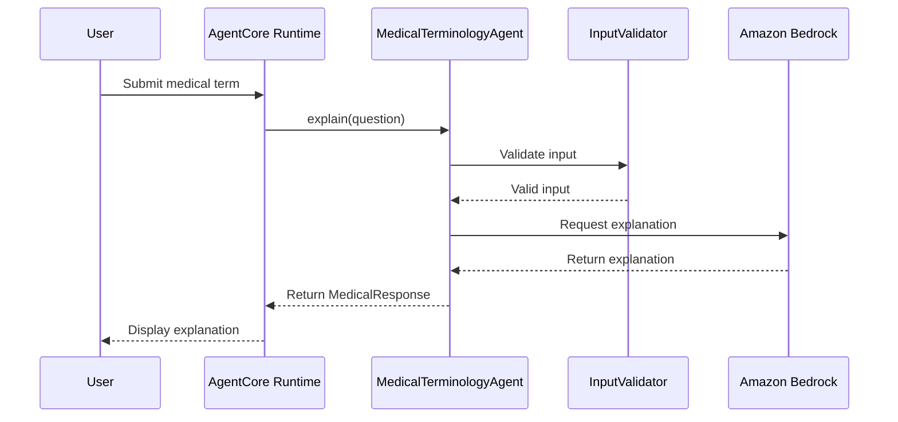

# Agent Request Flow

The following steps describe how the application processes a user's request.

## Request Flow

1. The user submits a medical term.
2. AgentCore Runtime forwards the request to the Medical Terminology Agent.
3. The agent validates the user input.
4. If the input is valid, the agent sends the request to Amazon Bedrock.
5. Amazon Bedrock generates an explanation in simple language.
6. The agent returns the response to AgentCore Runtime.
7. AgentCore Runtime sends the explanation back to the user.

If Amazon Bedrock is unavailable, the application checks the local knowledge base for the requested medical term. If the term is available, the explanation is returned from the local knowledge base instead.

This approach keeps the request flow simple while allowing the application to continue responding even if Amazon Bedrock is temporarily unavailable.