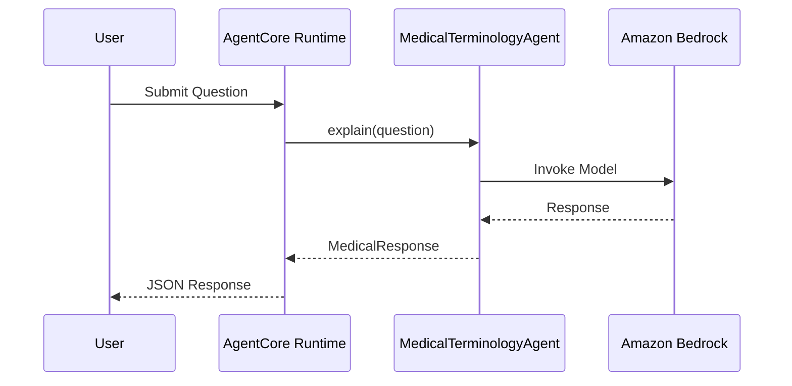

# Agent Flow

```mermaid
sequenceDiagram

User->>AgentCore Runtime: Submit Question

AgentCore Runtime->>MedicalTerminologyAgent: explain(question)

MedicalTerminologyAgent->>Amazon Bedrock: Invoke Model

Amazon Bedrock-->>MedicalTerminologyAgent: Response

MedicalTerminologyAgent-->>AgentCore Runtime: MedicalResponse

AgentCore Runtime-->>User: JSON Response
```