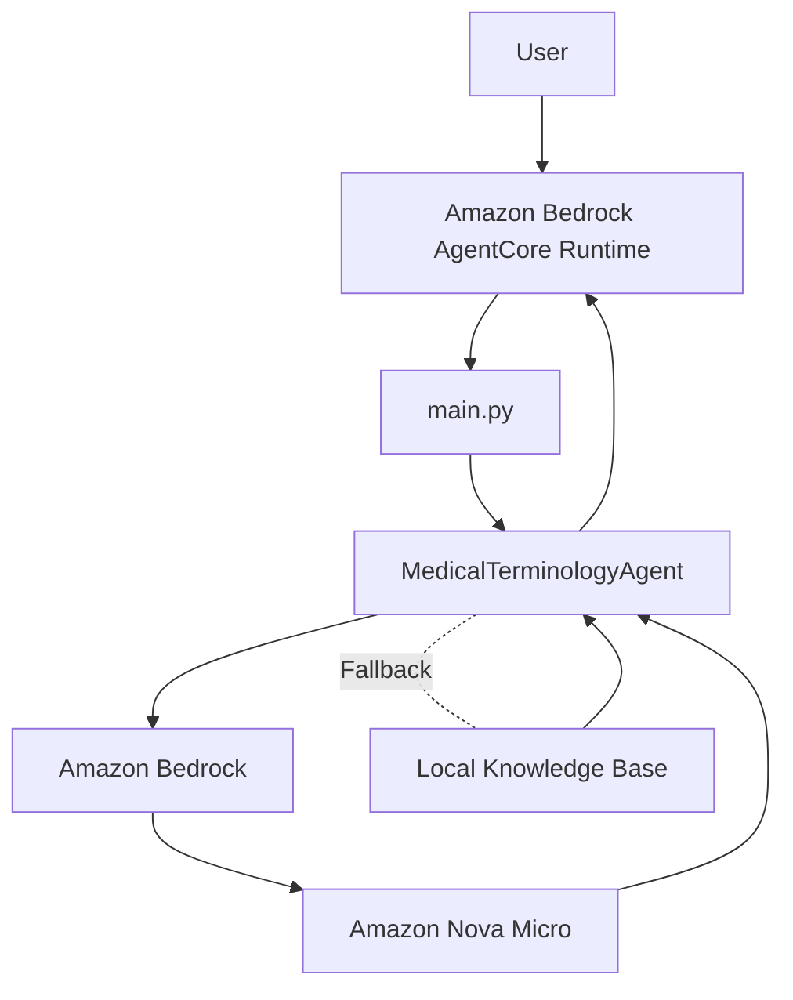

# Medical Terminology Agent Architecture

```mermaid
flowchart TD

    User["User"]

    Runtime["Amazon Bedrock AgentCore Runtime"]

    Main["main.py"]

    Agent["MedicalTerminologyAgent"]

    Bedrock["Amazon Bedrock"]

    Nova["Amazon Nova Micro"]

    KB["Local Knowledge Base"]

    User --> Runtime

    Runtime --> Main

    Main --> Agent

    Agent --> Bedrock

    Bedrock --> Nova

    Nova --> Agent

    Agent --> Runtime

    Agent -.Fallback.- KB

    KB --> Agent
```