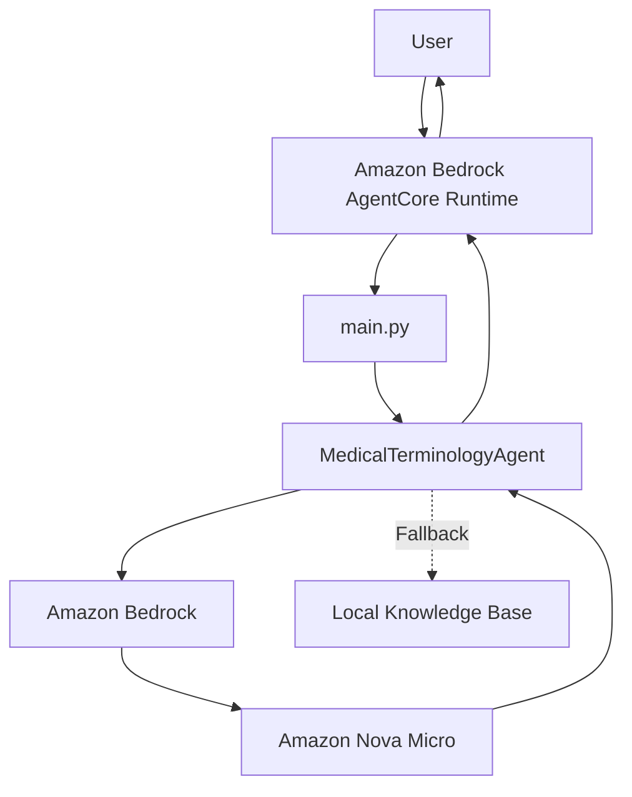

# System Architecture

The Medical Terminology Agent follows a simple layered architecture.

The user sends a request to the Amazon Bedrock AgentCore Runtime. The runtime forwards the request to the application, where the input is validated. If the input is valid, the application sends the request to Amazon Bedrock (Nova Micro) to generate a simple explanation.

If Amazon Bedrock is unavailable, the application uses the local knowledge base to provide an explanation for supported medical terms.

The application logic is kept separate from the deployment layer, which makes the code easier to maintain and test. The fallback to the local knowledge base also helps the application continue working if Amazon Bedrock is temporarily unavailable.