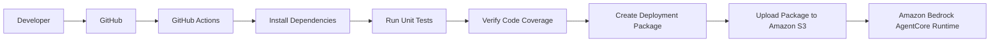

# CI/CD Pipeline

A GitHub Actions workflow is used to automate the build process for the project.

Whenever changes are pushed to the **main** branch, the workflow automatically validates the application before preparing it for deployment.

The pipeline performs the following steps:

1. Checks out the latest source code.
2. Installs the required project dependencies.
3. Runs all unit tests.
4. Verifies that the required code coverage is met.
5. Creates the deployment package.
6. Uploads the deployment package to Amazon S3.

The uploaded package can then be used to deploy or update the Amazon Bedrock AgentCore Runtime.

This pipeline helps ensure that the deployment package is created from tested code. It also reduces manual effort by automatically packaging the application and uploading it to Amazon S3 whenever changes are pushed to the repository.