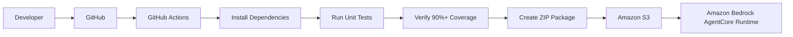

# CI/CD Pipeline

```mermaid
flowchart LR

Developer --> GitHub

GitHub --> GitHubActions["GitHub Actions"]

GitHubActions --> Install["Install Dependencies"]

Install --> Test["Run Unit Tests"]

Test --> Coverage["Verify 90%+ Coverage"]

Coverage --> Package["Create ZIP Package"]

Package --> S3["Amazon S3"]

S3 --> AgentCore["Amazon Bedrock AgentCore Runtime"]
```